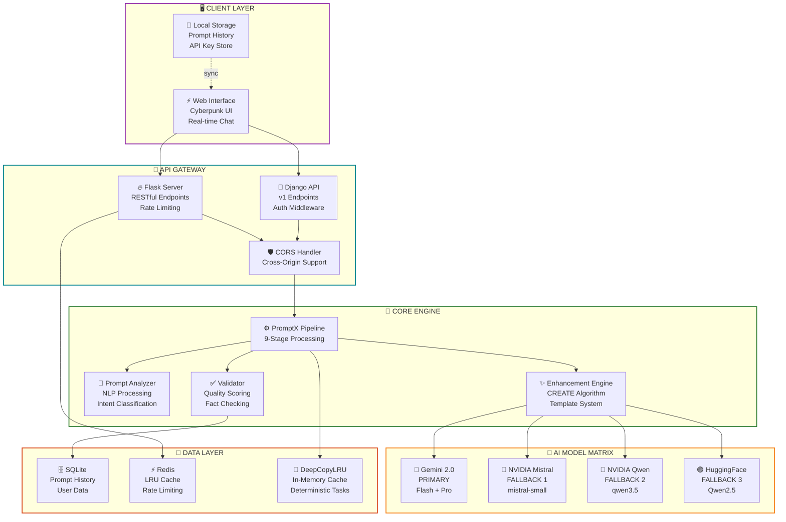
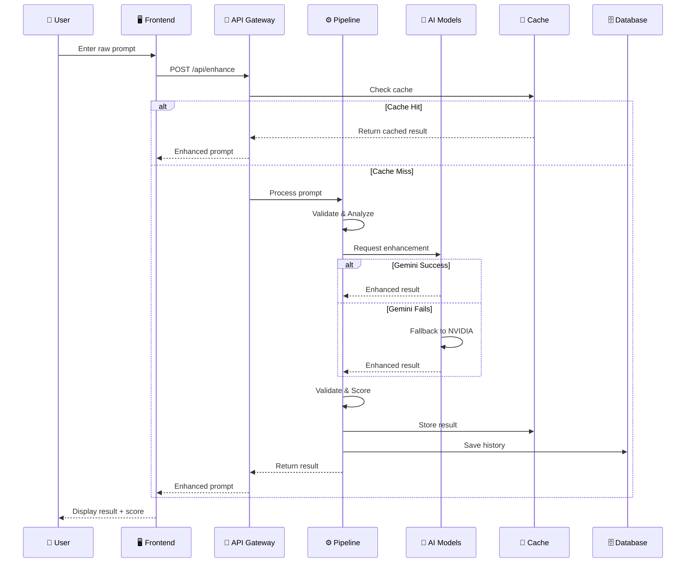
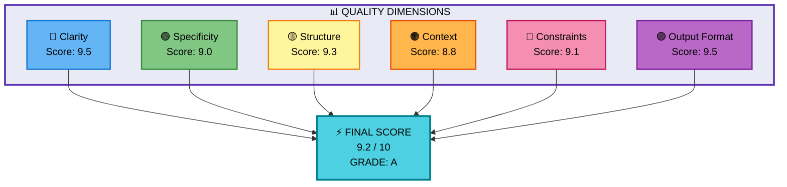
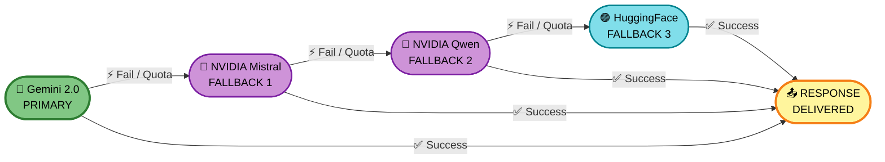
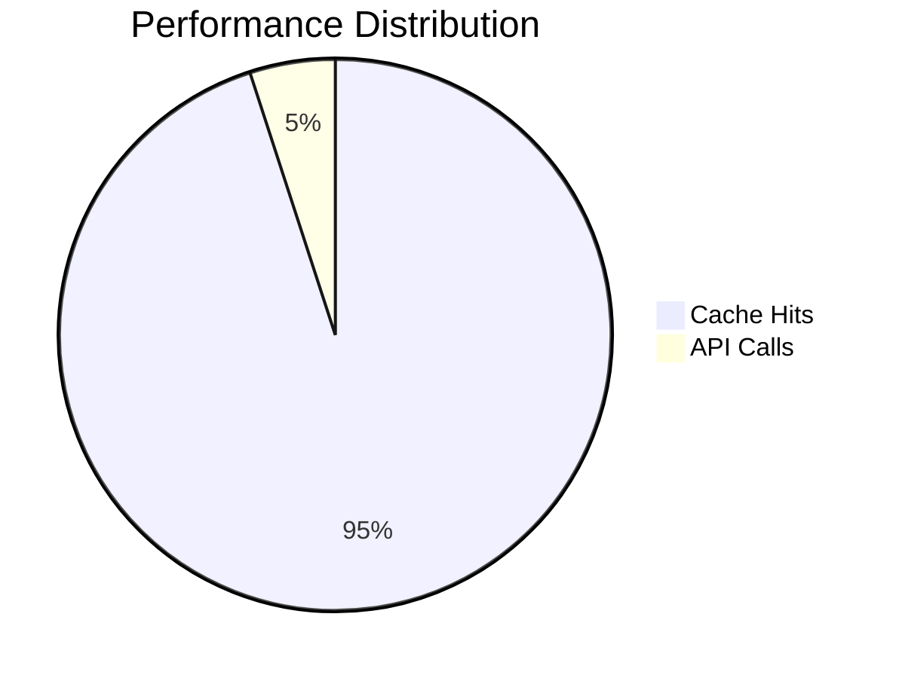

<div align="center">

<!-- HEADER -->


<br/>

**Neural Prompt Enhancement Protocol • v2.0**  
*Transform Raw Ideas Into AI Mastercraft*

<br/>

### ⚡ PromptX — Neural Prompt Enhancement Platform
**[ SYSTEM ONLINE ]** • *Transform raw prompts into professional, AI-optimized mastercraft*

<br/>

[](https://python.org)
[](https://www.djangoproject.com/)
[](https://ai.google.dev/)
[](https://flask.palletsprojects.com/)
[](LICENSE)
[](LICENSE)

<br/>

---

**Quick Navigation:** 🚀 [Quick Start](#-initialization-sequence) • 🧠 [Features](#-feature-matrix) • 📡 [API Docs](#-api-endpoints) • 🏗️ [Architecture](#️-system-architecture) • 🎮 [Usage](#-operation-manual) • 📊 [Quality](#-quality-scoring-system) • 🗺️ [Roadmap](#️-development-roadmap) • 🐛 [Troubleshoot](#-troubleshooting)

---

</div>


<br/>

## 🧬 SYSTEM OVERVIEW

PromptX is an AI-powered prompt enhancement platform that uses multi-model AI orchestration and a 9-stage enhancement pipeline to transform basic, vague prompts into professional, structured instructions that consistently deliver superior AI responses.

💡 Stop struggling with vague, underperforming prompts  
💡 Let the neural engine do the heavy lifting  
💡 Get AI-grade output every single time

<br/>

> 💡 **TL;DR** — Feed in a messy prompt. Get back a precision-engineered AI instruction. Powered by Gemini 2.0 with an automatic fallback chain across 4 AI providers.

<br/>

## 🏗️ SYSTEM ARCHITECTURE





<br/>

## 🔄 ENHANCEMENT PIPELINE

```mermaid
flowchart LR
    A(["📥 RAW<br/>INPUT"]) --> B["1️⃣ VALIDATE<br/>Length & Format<br/>Check"]
    B --> C["2️⃣ ANALYZE<br/>Intent & NLP<br/>Parsing"]
    C --> D["3️⃣ COMPLEXITY<br/>Difficulty<br/>Scoring"]
    D --> E["4️⃣ CONTEXT<br/>Section<br/>Building"]
    E --> F["5️⃣ TEMPLATE<br/>Assembly &<br/>Structuring"]
    F --> G["6️⃣ REFINE<br/>Iterative<br/>Improvement"]
    G --> H["7️⃣ VALIDATE<br/>Output<br/>Quality Check"]
    H --> I["8️⃣ FACT CHECK<br/>Source<br/>Verification"]
    I --> J["9️⃣ SCORE<br/>Quality<br/>Grading"]
    J --> K(["📤 ENHANCED<br/>OUTPUT"])

    style A fill:#f48fb1,stroke:#c2185b,stroke-width:3px,color:#000,rx:20
    style K fill:#81c784,stroke:#2e7d32,stroke-width:3px,color:#000,rx:20
    style B fill:#b3e5fc,stroke:#0277bd,stroke-width:2px,color:#000
    style C fill:#b3e5fc,stroke:#0277bd,stroke-width:2px,color:#000
    style D fill:#e1bee7,stroke:#7b1fa2,stroke-width:2px,color:#000
    style E fill:#e1bee7,stroke:#7b1fa2,stroke-width:2px,color:#000
    style F fill:#fff59d,stroke:#f57f17,stroke-width:2px,color:#000
    style G fill:#fff59d,stroke:#f57f17,stroke-width:2px,color:#000
    style H fill:#ffab91,stroke:#d84315,stroke-width:2px,color:#000
    style I fill:#ffab91,stroke:#d84315,stroke-width:2px,color:#000
    style J fill:#a5d6a7,stroke:#388e3c,stroke-width:2px,color:#000
```




**Pipeline Stages:**

| # | Stage | Description |
|:---:|:-------------|:------------|
| 1️⃣ | **VALIDATE** | Length checks, format verification, sanitization |
| 2️⃣ | **ANALYZE** | spaCy NLP parsing, TextBlob sentiment, tokenize |
| 3️⃣ | **COMPLEXITY** | Difficulty scoring, domain classification |
| 4️⃣ | **CONTEXT** | Background framing, persona injection |
| 5️⃣ | **TEMPLATE** | Structured assembly using dynamic template engine |
| 6️⃣ | **REFINE** | Iterative improvement loop with AI feedback |
| 7️⃣ | **VALIDATE** | Output quality gating & structural checks |
| 8️⃣ | **FACT CHECK** | Resource verification, claim validation |
| 9️⃣ | **SCORE** | 6-dimension quality grading, final report |

<br/>

## 🔄 DATA FLOW DIAGRAM




<br/>

## ⚡ FEATURE MATRIX


| 🔮 Module | ⚡ Status | 📋 Description |
|:----------|:---------:|:---------------|
| **CORE** Pipeline Engine | ✅ ACTIVE | 9-stage enhancement pipeline with iterative refinement |
| **AI** Multi-Model Fallback | ✅ ACTIVE | Gemini → NVIDIA Mistral → NVIDIA Qwen → HuggingFace |
| **NLP** Intent Detection | ✅ ACTIVE | Auto-classify prompt intent using spaCy + TextBlob |
| **ANALYZE** Quality Heatmap | ✅ ACTIVE | 6-dimension scoring with visual breakdown |
| **AB_TEST** Variations | ✅ ACTIVE | Generate Concise / Detailed / Structured variants |
| **VALIDATE** Input Security | ✅ ACTIVE | Regex sanitization & injection protection |
| **CACHE** DeepCopyLRU | ✅ ACTIVE | Zero-latency caching for deterministic tasks |
| **HISTORY** Prompt Storage | ✅ ACTIVE | SQLite + LocalStorage with JSON export |
| **RATE_LIMIT** Throttling | ✅ ACTIVE | Flask-Limiter with configurable thresholds |
| **UI** Modern Interface | ✅ ACTIVE | Real-time chat playground with clean aesthetics |
| **BATCH** Bulk Processing | ✅ ACTIVE | Multi-prompt enhancement via batch endpoint |
| **MOBILE** Responsive Design | 🔄 WIP | Adaptive layout for all screen sizes |

<br/>

## 🚀 INITIALIZATION SEQUENCE


### 📋 SYSTEM REQUIREMENTS

| ⚙️ Requirement | 📦 Details | 🔗 Source |
|:---------------|:-----------|:----------|
| ✅ Python 3.8+ | Core runtime environment | [python.org](https://python.org) |
| ✅ Gemini API Key | Primary AI model — Required | [ai.google.dev](https://ai.google.dev) |
| ⬜ NVIDIA API Key | Fallback model — Optional | [nvidia.com](https://nvidia.com) |
| ⬜ HuggingFace Key | Fallback model — Optional | [huggingface.co](https://huggingface.co) |
| ⬜ Redis | Caching layer — Optional | [redis.io](https://redis.io) |

<br/>

### ⚡ STEP-BY-STEP BOOT SEQUENCE

**STEP 01 — Clone the Repository**

```bash
git clone https://github.com/Santosh-Prasad-Verma/PromptX.git
cd PromptX
```

**STEP 02 — Create Virtual Environment**

```bash
python3 -m venv venv

# macOS / Linux
source venv/bin/activate

# Windows
venv\Scripts\activate
```

**STEP 03 — Install Dependencies**

```bash
pip install -r requirements.txt            # Flask backend
pip install -r backend/requirements.txt    # Django components
```

**STEP 04 — Configure Environment**

```bash
cp .env.example .env
# Open .env and insert your API keys — see Environment section below
```

**STEP 05 — Run Database Migrations**

```bash
cd backend
python manage.py makemigrations
python manage.py migrate
```

**STEP 06 — Launch Servers**

```bash
# Terminal 1 — Flask API
python app.py
# ⚡ Running at: http://localhost:5000

# Terminal 2 — Django API
python manage.py runserver
# ⚡ Running at: http://localhost:8000
```

> 💡 **Quick Deploy** — Run `./run-backend.sh` to boot both servers simultaneously with one command.


<br/>

## 📁 PROJECT STRUCTURE


```text
PromptX/
│
├── 🌐 frontend/
│   ├── 📄 index.html                   # Landing Page — Cyberpunk UI
│   ├── 💬 chat.html                    # Playground — Real-time Chat
│   ├── 🎨 index.css                    # Neon Stylesheet & Animations
│   ├── ⚙️  index.js                    # Core Frontend Logic
│   └── 📦 Public/
│       ├── 🌟 star.gif                 # Animated Logo Banner
│       ├── 🤖 bot-img.png              # Neural Assistant Avatar
│       └── 🔊 [audio assets]           # UI Sound Effects
│
├── ⚙️  backend/
│   ├── 🔥 app.py                       # Flask API — Production Server
│   ├── 🧠 services.py                  # AI Services & Fallback Matrix
│   ├── 🐍 manage.py                    # Django Management CLI
│   ├── 📋 requirements.txt             # Python Dependencies
│   ├── 🗄️  db.sqlite3                  # SQLite Database
│   │
│   ├── 📡 api/                         # RESTful API Layer
│   │   ├── views.py                    # Endpoint Request Handlers
│   │   ├── urls.py                     # Route Definitions
│   │   └── middleware.py               # Auth & CORS Middleware
│   │
│   ├── ✨ enhancer/                    # Core Enhancement Engine
│   │   ├── views.py                    # API View Controllers
│   │   ├── models.py                   # Database Models
│   │   ├── serializers.py              # Request/Response Serialization
│   │   │
│   │   ├── 🧠 core/                    # Pipeline Components
│   │   │   ├── pipeline.py             # Master 9-Stage Orchestrator
│   │   │   ├── analyzer.py             # NLP & Linguistic Analysis
│   │   │   ├── context_builder.py      # Contextual Section Generator
│   │   │   ├── quality_scorer.py       # 6-Dimension Quality Metrics
│   │   │   ├── validator.py            # Input/Output Validation
│   │   │   ├── fact_checker.py         # Resource & Claim Verification
│   │   │   ├── refinement.py           # Iterative Improvement Loop
│   │   │   ├── template_manager.py     # Prompt Template System
│   │   │   ├── intent_classifier.py    # Intent Detection Module
│   │   │   └── complexity_assessor.py  # Difficulty Scoring Engine
│   │   │
│   │   ├── 🔧 utils/                   # Shared Utilities
│   │   │   ├── text_processing.py      # Text Normalization & Cleaning
│   │   │   ├── helpers.py              # Common Helper Functions
│   │   │   └── constants.py            # System-wide Constants
│   │   │
│   │   └── 🗃️  migrations/             # Django DB Migrations
│   │
│   └── 🏗️  promptx_project/            # Django Project Config
│       ├── settings.py                 # Application Settings
│       ├── urls.py                     # Root URL Configuration
│       └── wsgi.py                     # WSGI Production Entry
│
├── 🧪 tests/
│   └── test_fallback.py                # AI Fallback Chain Tests
│
├── 📄 .env.example                     # Environment Variable Template
├── 🚫 .gitignore                       # Git Ignore Rules
├── 📋 CHANGELOG.md                     # Version History
├── 🤝 CONTRIBUTING.md                  # Contribution Guidelines
├── ⚖️  LICENSE                         # MIT License
├── 📖 README.md                        # ← You are here
├── 🚀 run-backend.sh                   # Server Boot Script
├── ▲  vercel.json                      # Vercel Deployment Config
└── 📦 requirements.txt                 # Root Dependencies
```


<br/>

## 🎮 OPERATION MANUAL


<details open>
<summary><b>⚡ PROTOCOL 01 — ENHANCE</b></summary>

Transform any raw prompt into a precision-engineered AI instruction.

- 📥 **INPUT** → Any raw user prompt (even one-liners)
- ⚙️ **PROCESS** → Full 9-stage pipeline execution
- 📤 **OUTPUT** → AI-optimized, professional-grade prompt

**Features:**
- 💎 Adds context, structure, constraints & output format spec
- 💎 Provides quality score with detailed breakdown
- 💎 Shows which AI model processed your request

</details>

<details>
<summary><b>🔬 PROTOCOL 02 — ANALYZE</b></summary>

Get a detailed quality breakdown across 6 scoring dimensions.

- 📊 **METRICS** → Clarity · Specificity · Structure · Context · Constraints · Output Format
- 📤 **OUTPUT** → Scored heatmap with improvement suggestions

**Features:**
- 💎 Identifies weak points before you hit send
- 💎 Visual heatmap shows exactly where to improve

</details>

<details>
<summary><b>🔀 PROTOCOL 03 — A/B TEST</b></summary>

Generate three style variants of your prompt simultaneously.

- 💙 **VARIANT A** → Concise — Short, focused, minimal
- 💜 **VARIANT B** → Detailed — Comprehensive, in-depth, thorough
- 💚 **VARIANT C** → Structured — Organized, sectioned, formatted

**Features:**
- 💎 Distributed across available AI models for speed
- 💎 Pick the variant that fits your specific use case

</details>

<details>
<summary><b>📚 PROTOCOL 04 — HISTORY</b></summary>

Access, search, and export your complete prompt history.

- 🗄️ **STORAGE** → SQLite (server-side) + LocalStorage (client-side)
- 📤 **EXPORT** → JSON format with full metadata & timestamps

**Features:**
- 💎 Full metadata including model used, score, and timing
- 💎 One-click export for offline archiving

</details>

<br/>

## 📡 API ENDPOINTS


### 🔥 Flask API — `http://localhost:5000`

| ⚡ Method | 🛣️ Endpoint | 📋 Description | 🔑 Auth |
|:---------:|:------------|:---------------|:-------:|
| `GET` | `/health` | System diagnostics & uptime check | — |
| `POST` | `/api/enhance` | AI prompt enhancement pipeline | Optional |
| `POST` | `/api/detect-intent` | NLP intent classification | Optional |
| `POST` | `/api/quality-heatmap` | 6-dimension quality analysis | Optional |
| `POST` | `/api/ab-test` | Generate A/B style variations | Optional |

### 🐍 Django API — `http://localhost:8000/api/v1/`

| ⚡ Method | 🛣️ Endpoint | 📋 Description | 🔑 Auth |
|:---------:|:------------|:---------------|:-------:|
| `GET` | `/health/` | System health check | — |
| `POST` | `/enhance/` | Full 9-stage pipeline execution | — |
| `POST` | `/analyze/` | Deep linguistic analysis | — |
| `POST` | `/validate/` | Validation + fact checking | — |
| `POST` | `/compare/` | Side-by-side prompt comparison | — |
| `POST` | `/batch-enhance/` | Bulk prompt processing | — |
| `POST` | `/feedback/` | User rating submission | — |

<br/>

<details>
<summary><b>📦 EXAMPLE REQUEST & RESPONSE — Click to Expand</b></summary>

<br/>

**🔵 Request**

```json
POST /api/enhance
Content-Type: application/json

{
  "prompt": "make a website",
  "api_key": "your_optional_key"
}
```

**🟢 Response**

```json
{
  "status": "success",
  "model_used": "gemini-2.0-flash",
  "original": "make a website",
  "enhanced": "Design and develop a fully responsive, modern web application using HTML5, CSS3, and JavaScript. The site should include: a hero section with a clear call-to-action, smooth scroll navigation, mobile-first responsive layout, optimized page load performance under 2 seconds, and WCAG 2.1 accessibility compliance. Deliver clean, commented code with a modular file structure.",
  "quality_score": 9.2,
  "quality_grade": "A",
  "dimensions": {
    "clarity": 9.5,
    "specificity": 9.0,
    "structure": 9.3,
    "context": 8.8,
    "constraints": 9.1,
    "output_format": 9.5
  },
  "processing_time": "1.43s",
  "pipeline_stages_completed": 9
}
```

**🔴 Error Response**

```json
{
  "status": "error",
  "code": 429,
  "message": "Rate limit exceeded. Try again in 60 seconds.",
  "fallback_attempted": true,
  "model_chain_exhausted": false
}
```

</details>


<br/>

## ⚙️ TECH STACK


| 🔮 Layer | 💻 Technology | 🎯 Role |
|:---------|:--------------|:--------|
| **Frontend** | HTML5 · CSS3 · Vanilla JS | Cyberpunk UI with real-time chat |
| **API Gateway** | Flask + Django REST Framework | Dual-backend REST architecture |
| **AI Primary** | Google Gemini 2.0 Flash/Pro | Primary inference engine |
| **AI Fallback** | NVIDIA Mistral · Qwen · HuggingFace | Automatic failover chain |
| **Caching** | DeepCopyLRU + Redis | Zero-latency deterministic caching |
| **Database** | SQLite + Django ORM | Persistent prompt history |
| **Security** | Flask-Limiter · Regex Sanitization | Rate limiting & input protection |
| **NLP** | spaCy · TextBlob · tiktoken | Linguistic analysis & tokenization |
| **Deploy** | Vercel · Gunicorn WSGI | Production-grade serving |

<br/>

## 📊 QUALITY SCORING SYSTEM




### 🔬 SCORING DIMENSIONS

| 🎨 Dimension | 📋 What It Measures |
|:-------------|:--------------------|
| 🔵 **Clarity** | Removes ambiguity, ensures precise and unambiguous language |
| 🟢 **Specificity** | Adds concrete details and measurable, verifiable requirements |
| 🟡 **Structure** | Organizes content with headers, sections, and logical flow |
| 🟠 **Context** | Provides background info, persona, scenario, and framing |
| 🔴 **Constraints** | Defines strict boundaries, forbidden actions, and limitations |
| 🟣 **Output Format** | Specifies exact response format — JSON, Markdown, lists, etc. |

### 🏆 GRADING SCALE

| Grade | Score Range | Assessment |
|:-----:|:-----------:|:-----------|
| 💎 **A** | 9.0 – 10.0 | Exceptional — production ready |
| 💙 **B** | 7.0 – 8.9 | Good — minor improvements possible |
| 💛 **C** | 5.0 – 6.9 | Average — needs significant work |
| 🧡 **D** | 3.0 – 4.9 | Poor — major structural issues found |
| ❤️ **F** | 0.0 – 2.9 | Critical — complete rewrite required |


<br/>

## 🔐 ENVIRONMENT CONFIGURATION


Create a `.env` file in the project root:

```bash
# ╔══════════════════════════════════════════════════════════════╗
# ║  PRIMARY AI MODEL — REQUIRED                                 ║
# ╚══════════════════════════════════════════════════════════════╝
# Get your key → https://ai.google.dev
GEMINI_API_KEY=your_gemini_api_key_here

# ╔══════════════════════════════════════════════════════════════╗
# ║  FALLBACK MODELS — OPTIONAL                                  ║
# ║  Enables automatic failover when primary quota is exceeded   ║
# ╚══════════════════════════════════════════════════════════════╝
NVIDIA_MISTRAL_API_KEY=your_nvidia_key_here
NVIDIA_QWEN_API_KEY=your_nvidia_key_here
HUGGINGFACE_API_KEY=your_hf_key_here
OPENAI_API_KEY=your_openai_key_here

# ╔══════════════════════════════════════════════════════════════╗
# ║  SERVER CONFIGURATION                                        ║
# ╚══════════════════════════════════════════════════════════════╝
PORT=5000
DEBUG=False
CLIENT_API_KEY=your_optional_protection_key

# ╔══════════════════════════════════════════════════════════════╗
# ║  DATABASE & CACHE                                            ║
# ╚══════════════════════════════════════════════════════════════╝
DATABASE_URL=sqlite:///backend/db.sqlite3
REDIS_URL=redis://localhost:6379/0
```

<br/>

## 🔄 INTELLIGENT FALLBACK CHAIN




**Why This Matters:**

- 💙 Zero downtime — auto-failover on API errors or quota limits
- 💙 Transparency — every response shows which model was used
- 💙 Minimal setup — fully functional with just one API key
- 💙 Cost control — falls back to free-tier models when needed
- 💙 Speed optimized — fallback switch completes in under 500ms

<br/>

## 📈 PERFORMANCE METRICS


| 📊 Metric | 🎯 Target | 📉 Current | ⚡ Status |
|:----------|:---------:|:----------:|:---------:|
| ⚡ Avg Response Time | < 2.0s | ~1.4s | ✅ OPTIMAL |
| 💾 Cache Hit Rate | > 90% | 95%+ | ✅ OPTIMAL |
| 📦 Frontend Bundle Size | < 100KB | ~50KB | ✅ OPTIMAL |
| 🚀 Cold Start Time | < 5s | < 3s | ✅ OPTIMAL |
| 🔄 Fallback Switch Speed | < 1s | < 500ms | ✅ OPTIMAL |
| 🛡️ Uptime Target | 99.5% | 99.9% | ✅ OPTIMAL |
| 🧠 Pipeline Stages | 9 | 9 | ✅ COMPLETE |
| 🤖 AI Model Options | 4 | 4 | ✅ ACTIVE |

<br/>




<br/>

## 🐛 TROUBLESHOOTING


<details>
<summary><b>❌ ERROR — Server Connection Failed</b></summary>

<br/>

**Diagnostic Checklist:**

- 🔍 Verify .env exists with valid GEMINI_API_KEY
- 🔍 Confirm Python 3.8+ → `python3 --version`
- 🔍 Reinstall dependencies → `pip install -r requirements.txt`
- 🔍 Check port conflicts → `lsof -i :5000`
- 🔍 Test health endpoint → `curl localhost:5000/health`

</details>

<details>
<summary><b>❌ ERROR — Frontend Not Responding</b></summary>

<br/>

**Diagnostic Checklist:**

- 🔍 Confirm backend running → http://localhost:5000
- 🔍 Open browser console → F12 — look for CORS errors
- 🔍 Verify CORS middleware is enabled in app.py
- 🔍 Disable browser extensions — may block API calls

</details>

<details>
<summary><b>❌ ERROR — API Request Failed (4xx / 5xx)</b></summary>

<br/>

**Diagnostic Checklist:**

- 🔍 Validate API key at provider dashboard
- 🔍 Check rate limiting → HTTP 429 errors
- 🔍 Review server logs → backend/promptx.log
- 🔍 Run health check → GET /health
- 🔍 Verify fallback keys → check .env values

</details>

<details>
<summary><b>❌ ERROR — Database Migration Failed</b></summary>

<br/>

**Recovery Sequence:**

```bash
cd backend
python manage.py makemigrations
python manage.py migrate
ls -la db.sqlite3  # Check file permissions
# If corrupted, delete db.sqlite3 & retry
```

</details>

<br/>

## 🗺️ DEVELOPMENT ROADMAP


**PHASE 1 — CORE SYSTEM** ████████████████████ 100% ✅

- 💙 Multi-model AI fallback chain
- 💙 9-stage enhancement pipeline
- 💙 DeepCopyLRU intelligent caching
- 💙 Input sanitization & validation

**PHASE 2 — API LAYER** ████████████████████ 100% ✅

- 💙 Flask REST API with rate limiting
- 💙 Django REST Framework integration
- 💙 Configurable rate limiting thresholds
- 💙 API key authentication layer

**PHASE 3 — UI / UX** ███████████████░░░░░ 75% 🔄

- 💙 Modern landing page
- 💙 Real-time chat playground
- 💙 Prompt history with JSON export
- 🔄 Mobile responsive design (in progress)

**PHASE 4 — ADVANCED** ░░░░░░░░░░░░░░░░░░░░ 0% 💡

- 💡 Claude / Anthropic model support
- 💡 Team collaboration workspace
- 💡 Chrome browser extension
- 💡 Native mobile application
- 💡 Prompt marketplace / sharing
- 💡 Custom template builder UI

**Development Timeline:**

```
2024 Q1 ████████████ Phase 1: Core System (COMPLETE)
2024 Q2 ████████████ Phase 2: API Layer (COMPLETE)
2024 Q3 █████████░░░ Phase 3: UI/UX (IN PROGRESS - 75%)
2025 Q1 ░░░░░░░░░░░░ Phase 4: Advanced Features (PLANNED)
```


<br/>

## 📅 CHANGELOG


<details open>
<summary><b>⚡ v2.0 — CURRENT RELEASE</b></summary>

<br/>

### 🆕 Major Updates

- ✨ Added full Django backend with REST Framework
- ✨ Upgraded to 9-stage enhancement pipeline with validation & fact-checking
- ✨ Introduced SQLite + Django ORM for persistent history
- ✨ Added bulk prompt enhancement via /batch-enhance/ endpoint

### 🔧 Technical Improvements

- 🔬 spaCy + TextBlob NLP integration for deeper analysis
- 📊 Advanced 6-dimension quality scoring system
- 🧮 Complexity assessment engine
- 📝 Template management system with dynamic injection

</details>

<details>
<summary><b>🔒 v1.5 — Security & Production Hardening</b></summary>

<br/>

### 🔐 Security

- 🛡️ Gunicorn WSGI production server deployment
- 🔑 CLIENT_API_KEY authentication layer added
- 🚫 RegEx input sanitization against prompt injection
- 💾 DeepCopyLRUCache implementation for safe caching

### 🎨 Frontend

- 📤 Prompt history export to JSON
- 🔧 API Key configuration panel in UI
- ⚠️ Enhanced error handling & user-facing feedback messages

</details>

<details>
<summary><b>🌅 v1.0 — Initial Release</b></summary>

<br/>

### 🚀 Core

- 🔥 Flask backend with Gemini 2.0 integration
- 🔄 Multi-model fallback system (3 providers)
- 🎨 Cyberpunk-themed UI design
- 💾 LocalStorage prompt history

</details>

<br/>

## ⚖️ LICENSE

MIT License • Copyright (c) 2024 PromptX Team

Free to use, modify, and distribute with attribution.

See the LICENSE file for full legal terms.

<br/>

## 🤝 ACKNOWLEDGMENTS


| 🔮 | Contributor | 🎯 Role |
|:--:|:------------|:--------|
| 🔷 | **Google Gemini** | Primary AI inference engine |
| 🔶 | **NVIDIA** | Fallback model infrastructure |
| 🟣 | **HuggingFace** | Open-source model hosting |
| 🐍 | **Python Community** | Core language & ecosystem |
| 🌐 | **Django & Flask** | Web framework foundations |
| 💜 | **Open Source Community** | Collaboration & inspiration |

<br/>

## 📞 SUPPORT & CONTRIBUTING


| 📡 Channel | 🔗 Link |
|:-----------|:--------|
| 🐛 Bug Reports | [Open an Issue](../../issues) |
| 💬 Discussions | [Join the Conversation](../../discussions) |
| 🤝 Contributing | [Read the Guide](CONTRIBUTING.md) — Pull requests welcome! |
| 📋 Changelog | [Version History](CHANGELOG.md) |

<br/>

<div align="center">

```text
╔════════════════════════════════════════════════════════════════════════════════╗
║                                                                                ║
║     ⭐  If PromptX helped you, please consider leaving a star!  ⭐             ║
║         It keeps the neural network running and means everything.              ║
║                                                                                ║
║  ░░░░░░░░░░░░░░░░░░░░░░░░░░░░░░░░░░░░░░░░░░░░░░░░░░░░░░░░░░░░░░░░░░░░░░░░░░    ║
║                                                                                ║
║              Made with 💜 + ⚡ by the PromptX Team                             ║
║              [ SYSTEM SHUTDOWN — SEE YOU IN THE NET ]                          ║
║                                                                                ║
╚════════════════════════════════════════════════════════════════════════════════╝
```

<br/>

[](../../stargazers)
[](../../fork)
[](../../issues)

<br/>
<br/>

<p align="center">
  
</p>

<p align="center">
  <em>Transform • Enhance • Elevate</em>
</p>

</div>
